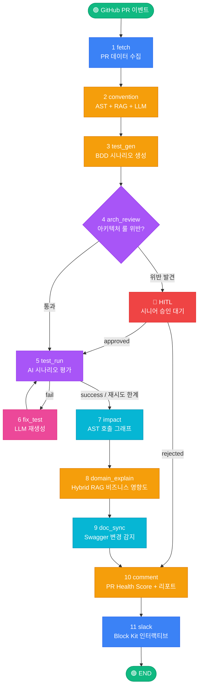

# 🤖 Smart PR Inspector Agent

> LangGraph 기반 GitHub Pull Request 자동 분석 AI 에이전트 플랫폼

> <a href="https://padlet.com/biz14/breakout-room/kxPM2kBAb0dO4gbV-qg3ezd5A12QEXwNP/wish/do3MQJwBKbJdZ15w
">구현 영상 링크</a>


### 🛠 Tech Stack

**Core AI / Agent**
[](https://langchain-ai.github.io/langgraph/)
[](https://www.langchain.com/)
[](https://anthropic.com)
[](https://docs.anthropic.com/)
[](#)
[](#)

**Hybrid RAG Pipeline**
[](https://www.trychroma.com/)
[](#)
[](#)
[](https://www.sbert.net/)
[](https://huggingface.co/)

**Backend**
[](https://python.org)
[](https://fastapi.tiangolo.com/)
[](https://docs.pydantic.dev/)
[](https://www.uvicorn.org/)
[](#)
[](https://www.sqlalchemy.org/)

**Frontend**
[](https://nextjs.org)
[](https://react.dev/)
[](https://www.typescriptlang.org/)
[](https://tailwindcss.com/)
[](https://www.radix-ui.com/)
[](https://zustand-demo.pmnd.rs/)
[](https://www.framer.com/motion/)

**Integrations**
[](https://docs.github.com/rest)
[](https://pygithub.readthedocs.io/)
[](https://slack.dev/bolt-python/)
[](https://swagger.io/)

**Infra / DevOps**
[](https://www.docker.com/)
[](https://redis.io/)
[](https://www.sqlite.org/)
[](https://www.postgresql.org/)
[](https://docs.pytest.org/)

---

## 개요

PR이 열리는 순간 자동으로 트리거되어, **컨벤션 검증 → BDD 시나리오 생성/평가 → 아키텍처 룰 점검 → 영향도 분석 → 비즈니스 영향도 설명 → 문서 동기화 → GitHub 코멘트 → Slack 인터랙티브 알림**까지 11개 노드의 워크플로우를 자동 수행하는 지능형 코드 리뷰 에이전트입니다.

```
코드를 잘 모르는 시니어 리뷰 부담 절감 │ 컨벤션 위반 자동 탐지 │ Hybrid RAG 도메인 분석 │ HITL 아키텍처 통제
```

---

## 주요 기능

| 기능 | 설명 |
|------|------|
| **컨벤션 검증** | Python AST 정적 분석 + 팀 컨벤션 RAG + LLM 하이브리드 |
| **AI 시나리오 검증** | LLM이 BDD Given-When-Then 시나리오 생성 후 PR diff와 대조 평가 |
| **HITL 아키텍처 점검** | 아키텍처 룰 위반 시 시니어 승인 대기 (Human-in-the-Loop) |
| **영향도 분석** | AST 호출 그래프로 변경 함수의 의존성·리스크 추적 |
| **Hybrid RAG 도메인 설명** | Dense(ChromaDB) + Sparse(BM25) + Re-ranking으로 비즈니스 영향도 자동 설명 |
| **PR Health Score** | 컨벤션·테스트·영향도·도메인 4영역 100점 만점 → S~F 등급 카드 |
| **Swagger 변경 감지** | API 엔드포인트 변경 자동 감지 + Swagger UI 스타일 시각화 |
| **Slack 인터랙티브** | ✅ 승인·🔄 수정요청 버튼 → GitHub Approve/Request Changes 자동 제출 |
| **RAG 문서 관리 UI** | 팀 컨벤션·도메인 문서 업로드/목록 조회/삭제 (대시보드) |
| **실시간 SSE 스트리밍** | 11개 노드 진행 상황을 Next.js 대시보드에 실시간 표시 |
| **SKILL.md 선언적 스킬** | 11개 스킬을 마크다운으로 선언, `SkillRegistry`가 파싱 |

---

## 4가지 워크플로우 Trigger

| # | Trigger | 발생 위치 | 입력 | 동작 |
|---|---------|----------|------|------|
| ① | **GitHub Webhook 자동** | GitHub | `pull_request.opened` 이벤트 | 11노드 자동 실행 → GitHub 코멘트 + Slack 알림 |
| ② | **대시보드 수동** | Next.js 화면 | repo + PR# 폼 입력 | `POST /api/analyze` → SSE 스트리밍 |
| ③ | **AI 채팅** | ChatPanel | 자연어 질문 | 분석 결과를 컨텍스트로 Claude 답변 (그래프 재실행 안 함) |
| ④ | **Slack 인터랙티브** | Slack 메시지 | 버튼 클릭 | `POST /slack/interactions` → GitHub 리뷰 자동 제출 |

> 4가지 Trigger 모두 동일한 LangGraph StateGraph + AgentState 모델을 공유합니다.

---

### 🧩 Mermaid 흐름도 (GitHub에서 자동 렌더링)



**색상 범례**
| 색상 | 의미 |
|------|------|
| 🟢 초록 | 워크플로우 시작/종료 |
| 🟦 파랑 | 외부 시스템 연동 (GitHub, Slack) |
| 🟧 주황 | LLM 호출 노드 |
| 🟪 보라 | 분기/평가 노드 |
| 🔵 하늘 | 정적 분석 노드 |
| 🔴 빨강 | Human-in-the-Loop (시니어 승인 대기) |
| 🩷 분홍 | 재시도/수정 루프 |

### 📝 노드별 상세

```
[1] fetch              ── PR diff, 변경 파일, 작성자 수집 (PyGithub)
[2] convention         ── AST 정적 분석 + 팀 컨벤션 RAG + LLM 검증
[3] test_gen           ── BDD Given/When/Then 시나리오 LLM 생성
[4] arch_review        ── 아키텍처 룰 점검 → 위반 시 HITL 시니어 승인 대기
[5] test_run           ── LLM이 시나리오 ↔ diff 대조 평가 (pass/fail/unclear)
[6] fix_test           ── 실패 시 LLM 자동 재생성 (최대 3회 재시도 루프)
[7] impact             ── AST 호출 그래프 + 리스크 레벨 산정
[8] domain_explain     ── Hybrid RAG (Dense+Sparse+Re-ranking)로 비즈니스 영향도
[9] doc_sync           ── Swagger/OpenAPI 변경 감지 + Swagger UI 스타일 시각화
[10] comment           ── PR Health Score 카드 + 통합 리포트 → GitHub 게시
[11] slack             ── Block Kit 인터랙티브 메시지 (✅승인 / 🔄수정요청 버튼)
```

> ⚠️ **참고**: `test_run`은 Docker에서 실제 코드를 실행하지 않습니다. **LLM이 시나리오와 diff를 대조해서 pass/fail/unclear를 평가하는 AI 시나리오 검증 방식**입니다. 환경 의존성·보안 리스크 없이, 도메인 전문가도 이해할 수 있는 평문 결과를 얻을 수 있습니다.

---

## RAG 파이프라인

**Hybrid RAG**는 두 노드(`convention`, `domain_explain`)에서 사용됩니다.

```
쿼리 (PR title + diff)
  │
  ├── Dense Path:  ChromaDB 벡터 검색 (DefaultEmbeddingFunction) → Top-20
  │                ※ 의미적 유사도 (예: "결제 프로세스 리팩토링")
  │
  ├── Sparse Path: BM25 (rank-bm25) 키워드 검색 → Top-20
  │                ※ 정확 매칭 (예: 함수명 `validate_card`)
  │
  └── RRF (Reciprocal Rank Fusion, k=60) → 통합 정렬
       │
       └── Re-ranking 단계 (Cross-Encoder ms-marco-MiniLM 모델)
            │
            └── Top-5 → LLM 컨텍스트로 전달
```

> **Re-ranking과 Cross-Encoder의 관계**: Re-ranking은 *단계*이고, Cross-Encoder는 그 단계에서 사용하는 *모델 아키텍처*입니다. 둘은 동의어가 아니라 포함 관계입니다. Re-ranking은 LLM 리랭커나 listwise 리랭커로도 구현할 수 있는데, 본 프로젝트는 정확도/속도 균형을 고려해 Cross-Encoder를 선택했습니다.

### 안전한 폴백
벡터 컬렉션이 비어있을 때(`store.count() == 0`)는 검색을 스킵하고 **LLM이 코드만 보고 추론**합니다. PR 코멘트의 도메인 섹션에 **🔍 RAG 문서 기반** 또는 **🤖 코드 추론** 배지를 표시해 사용자가 분석 근거를 명확히 알 수 있습니다.

---

## 기술 스택

### Backend Core

| 분류 | 기술 | 버전 | 역할 |
|------|------|------|------|
| Orchestration | **LangGraph** | 0.2.28 | StateGraph 기반 11노드 워크플로우 |
| LLM Chaining | **LangChain** | 0.3.7 | LLM 체이닝 |
| Primary LLM | **Anthropic Claude** | claude-sonnet-4-6 | 분석 / 채팅 |
| Secondary LLM | **OpenAI GPT-4o-mini** | — | 빠른 분석 |
| API Server | **FastAPI** | 0.115.5 | Webhook + SSE 스트리밍 |
| Validation | **Pydantic** | 2.x | AgentState 스키마 |

### RAG & Storage

| 분류 | 기술 | 버전 | 역할 |
|------|------|------|------|
| Vector DB (Dense) | **ChromaDB** | 0.5.18 | Dense 벡터 검색 (로컬, 무료) |
| Sparse Search | **rank-bm25** | 0.2.2 | BM25 키워드 검색 |
| Re-ranking 모델 | **sentence-transformers** | 3.3.1 | Cross-Encoder (ms-marco-MiniLM) |
| Cache | **Redis** | 7.x | 세션/분석 결과 캐싱 |
| History DB | **SQLAlchemy + SQLite/PostgreSQL** | — | PR 분석 이력 |

### Tools & Integrations

| 분류 | 기술 | 역할 |
|------|------|------|
| GitHub | **PyGithub** 2.3 | PR / Review API |
| Diff Parsing | **unidiff** 0.7.5 | Git diff 파싱 |
| Code Analysis | **ast** (내장) | Python AST 파싱, 호출 그래프 |
| Code Analysis | **pylint, radon, bandit** | (보조) 정적 분석 도구 |
| Slack | **slack-sdk + slack-bolt** | Block Kit + 인터랙티브 |
| Monitoring | **Prometheus** | `/metrics` 엔드포인트 |

### Frontend

| 기술 | 버전 | 역할 |
|------|------|------|
| **Next.js** (App Router) | 14.2.3 | React 프레임워크 |
| **TypeScript** | 5.x | 타입 안전성 |
| **Tailwind CSS** | 3.4.4 | 유틸리티 CSS |
| **Radix UI** | — | 헤드리스 컴포넌트 (Dialog, Tabs 등) |
| **Zustand** | 4.5.2 | 클라이언트 상태 관리 |
| **TanStack Query** | 5.40 | 서버 상태 관리 |
| **Framer Motion** | 11.2 | 워크플로우 노드 애니메이션 |
| **Recharts** | 2.12 | Health Score 시각화 |
| **react-markdown + rehype** | — | PR 리포트 렌더링 |
| **EventSource (SSE)** | — | 실시간 노드 상태 스트리밍 |

---

## 프로젝트 구조

```
smart-pr-inspector-agent/
├── agents/                   # LangGraph 에이전트
│   ├── orchestrator.py       # StateGraph 조립 (엣지/분기 정의)
│   ├── state.py              # Pydantic AgentState 모델
│   └── nodes/                # 11개 노드 구현
│       ├── fetcher.py
│       ├── convention.py     # AST + RAG + LLM
│       ├── test_gen.py       # BDD 시나리오 생성
│       ├── arch_review.py    # HITL 아키텍처 점검
│       ├── test_runner.py    # AI 시나리오 평가
│       ├── impact.py         # 호출 그래프 분석
│       ├── domain_explainer.py  # Hybrid RAG
│       ├── doc_sync.py       # Swagger 변경 감지
│       ├── risk_report.py    # PR Health Score 계산
│       ├── commenter.py      # GitHub 코멘트 빌더
│       └── slack_notify.py   # Slack Block Kit
├── api/
│   ├── webhook.py            # FastAPI 메인 (Webhook + SSE + Slack 핸들러)
│   └── rag_upload.py         # 팀 문서 업로드/조회/삭제 API
├── memory/
│   └── vector_store.py       # Hybrid RAG (Dense + BM25 + Reranker)
├── config/
│   ├── prompts.py            # LLM 프롬프트 중앙 관리
│   ├── llm.py                # LLM 호출 헬퍼
│   ├── conventions.yaml      # 팀 코딩 룰 (AST 검사용)
│   └── skills.py             # SKILL.md 파서
├── frontend/                 # Next.js 14 대시보드
│   └── src/
│       ├── app/              # App Router
│       ├── components/       # Sidebar, ChatPanel, WorkflowView 등
│       ├── store/            # Zustand
│       └── lib/              # API 클라이언트, 타입
├── docs/                     # 프로젝트 문서 (architecture, features, presentation 등)
├── tests/                    # pytest 테스트
├── SKILL.md                  # 11개 스킬 선언적 정의
├── CLAUDE.md                 # Claude Code 작업 지침
├── CHANGES.md                # 버전 이력
└── docker-compose.yml
```

---

## 핵심 API 엔드포인트

| 메서드 | 경로 | 설명 |
|--------|------|------|
| POST | `/webhook/github` | GitHub Webhook 수신 (서명 검증 필수) |
| POST | `/api/analyze` | 수동 분석 트리거 (SSE 스트리밍 응답) |
| GET | `/api/history` | 과거 PR 분석 이력 조회 |
| GET | `/api/skills` | SKILL.md 기반 스킬 메타데이터 조회 |
| POST | `/api/rag/upload/convention` | 팀 컨벤션 문서 업로드 |
| POST | `/api/rag/upload/domain` | 도메인 문서 업로드 |
| GET | `/api/rag/stats` | 인덱싱된 문서 목록 + 청크 수 |
| DELETE | `/api/rag/documents/{collection}/{filename}` | 문서 삭제 |
| POST | `/slack/events` | Slack Event Subscriptions URL |
| POST | `/slack/interactions` | Slack 인터랙티브 버튼 URL |
| GET | `/metrics` | Prometheus 메트릭 |

---

## 문서

- [`docs/overview.md`](docs/overview.md) — 프로젝트 개요
- [`docs/architecture.md`](docs/architecture.md) — 시스템 아키텍처
- [`docs/agent-workflow.md`](docs/agent-workflow.md) — 11노드 상세 설명
- [`docs/features.md`](docs/features.md) — 기능 상세
- [`docs/tech-stack.md`](docs/tech-stack.md) — 기술 스택
- [`docs/project-presentation.md`](docs/project-presentation.md) — 프로젝트 종합 문서
- [`SKILL.md`](SKILL.md) — 11개 스킬 선언적 정의
- [`CHANGES.md`](CHANGES.md) — 버전별 변경 이력

---
