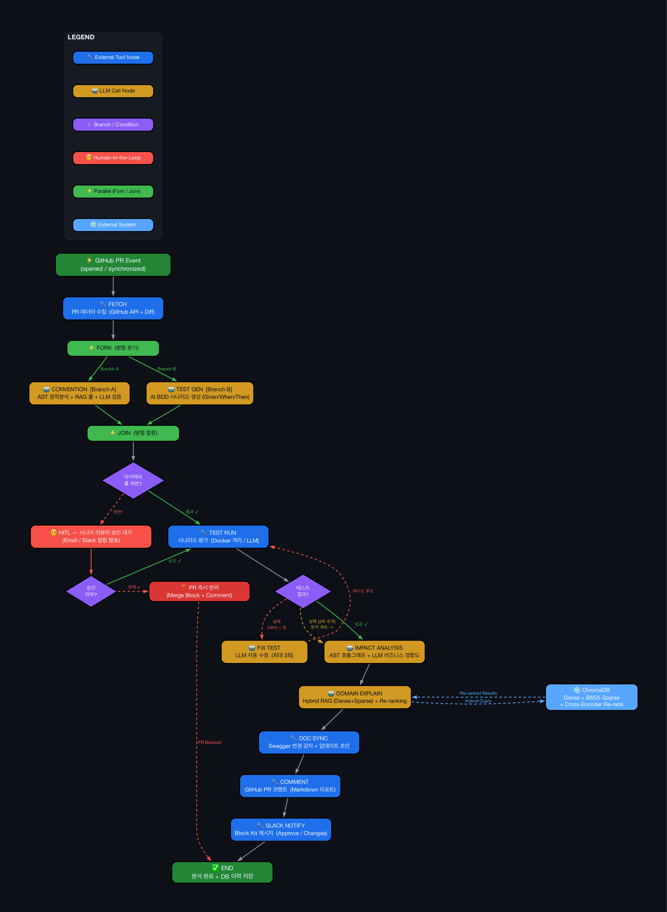

# Smart PR Inspector Agent — 프로젝트 종합 문서

---

## 1. 프로젝트 도식



### 다이어그램 범례

| 색상 | 의미 |
|------|------|
| 🟦 파랑 | 외부 Tool 노드 (GitHub API, Docker, Slack) |
| 🟨 주황 | LLM 호출 노드 (Claude / GPT) |
| 🟪 보라 마름모 | 분기 조건 (아키텍처 룰 위반?, 테스트 결과?) |
| 🟥 빨강 | Human-in-the-Loop (시니어 승인 대기) |
| 🟩 초록 | 시작/종료 트리거 |
| 🔵 하늘 | 외부 시스템 (ChromaDB) |
| 🔴 빨강 파선 | 실패/재시도 경로 |

### 고급 아키텍처 요소

| 요소 | 설명 | 왜 필요한가 |
|------|------|------------|
| **Human-in-the-Loop** | 아키텍처 룰 위반 시 시니어 리뷰어에게 알림 → 승인/반려 대기 | AI가 아키텍처 의사결정을 독단하지 않도록 인간의 통제 하에 둠 |
| **재시도/폴백** | 테스트 실패 시 LLM 자동 수정 + 최대 3회 재시도. 실패해도 나머지 분석 계속 | LLM 오류로 전체 파이프라인 중단 방지 |
| **Hybrid RAG** | Dense(벡터) + Sparse(BM25) + Cross-Encoder Re-ranking | 의미 검색 + 키워드 정확 매칭을 결합하여 도메인 문서 정밀 검색 |
| **PR Health Score** | 4영역(컨벤션/테스트/영향도/도메인) 100점 만점 → S~F 등급 | 머지 가능 여부를 한눈에 판단 |

---

## 2. 프로젝트 제목

### **Smart PR Inspector Agent**
> AI 기반 GitHub Pull Request 자동 분석 플랫폼

GitHub PR이 생성되면 자동으로 트리거되어, 코드 컨벤션 검증 → 테스트 시나리오 생성/평가 → 영향도 분석 → 비즈니스 설명 → 문서 동기화 → GitHub 코멘트 → Slack 알림까지 수행하는 지능형 코드 리뷰 에이전트입니다.

---

## 3. 해결하고자 한 Pain Point

| Pain Point | 구체적 문제 | 빈도 | 영향도 |
|------------|-----------|------|--------|
| **리뷰 병목** | 시니어 1명이 하루 10+ PR 리뷰 | 매일 | 높음 |
| **컨벤션 위반 반복** | 네이밍, 타입힌트 등 같은 지적 반복 | PR당 3회 | 중간 |
| **사이드 이펙트 미탐지** | 코드 변경이 타 모듈에 미치는 영향 파악 불가 | 월 5회 | 치명적 |
| **문서 불일치** | API 변경 후 Swagger 미업데이트 | 월 8회 | 높음 |
| **도메인 이해 부족** | 비즈니스 로직 변경 설명 부재 | PR당 1회 | 중간 |

---

## 4. 현재 구현된 정도 (v1.3.0)

| 기능 | 상태 |
|------|------|
| LangGraph 11노드 오케스트레이터 (HITL + 재시도) | ✅ |
| AST + LLM + RAG 하이브리드 컨벤션 검증 | ✅ |
| AI BDD 시나리오 생성/평가 (Given/When/Then) | ✅ |
| 아키텍처 룰 점검 + HITL 승인 대기 | ✅ |
| AST 호출그래프 + LLM 비즈니스 영향도 분석 | ✅ |
| Hybrid RAG 도메인 설명 (Dense+Sparse+Re-ranking) | ✅ |
| 팀 컨벤션/도메인 문서 업로드 → RAG 인덱싱 | ✅ |
| PR Health Score (100점 만점, S~F 등급) | ✅ |
| Slack 인터랙티브 (승인 메시지 + 수정 영역 선택) | ✅ |
| Next.js 14 대시보드 + AI 채팅 | ✅ |
| SKILL.md 선언적 스킬 정의 + 레지스트리 | ✅ |
| SSE 실시간 스트리밍 + 이력 관리 | ✅ |

---

## 5. 사용한 에이전트 프레임워크: LangGraph

LangGraph의 `StateGraph`를 사용한 이유:
- **조건부 분기**: `add_conditional_edges`로 HITL 승인/반려, 테스트 재시도 자연스럽게 구현
- **비동기 스트리밍**: `astream()`으로 SSE 실시간 업데이트
- **Pydantic State**: 타입 안전한 상태 관리

```python
workflow.set_entry_point("fetch")
workflow.add_edge("fetch", "convention")
workflow.add_edge("convention", "test_gen")
workflow.add_edge("test_gen", "arch_review")

# HITL 분기
workflow.add_conditional_edges("arch_review", check_arch_approval,
    {"approved": "test_run", "rejected": "comment"})

# 테스트 재시도 분기
workflow.add_conditional_edges("test_run", should_retry,
    {"retry": "fix_test", "success": "impact", "fail": "impact"})
```

---

## 6. 유저 쿼리문

| 시나리오 | 흐름 |
|---------|------|
| **Webhook 자동** | PR 생성 → Webhook → 11노드 분석 → GitHub 코멘트 + Slack 알림 |
| **수동 분석** | 대시보드에서 repo/PR# 입력 → SSE 실시간 노드 상태 표시 |
| **AI 채팅** | "이 PR에서 가장 위험한 변경은?" → Claude가 분석 결과 기반 답변 |
| **Slack 승인** | ✅ 버튼 → "~~~ 기능 PR 승인했습니다" 메시지 |
| **Slack 수정요청** | 🔄 버튼 → 수정 영역 선택 → "~~~ 기능 [영역] 수정 요청하였습니다" |

---

## 7. 사용한 Tools

| Tool | 용도 | 노드 |
|------|------|------|
| **ast** | Python AST 파싱, 호출 그래프 | convention, impact |
| **PyGithub** | GitHub REST API | fetcher, commenter |
| **ChromaDB** | Dense 벡터 검색 | domain_explain, convention (RAG) |
| **rank-bm25** | BM25 Sparse 키워드 검색 | domain_explain, convention (RAG) |
| **sentence-transformers** | Cross-Encoder Re-ranking | domain_explain |
| **OpenAI SDK** | GPT-4o-mini LLM 호출 | convention, test_gen, impact 등 |
| **Anthropic SDK** | AI 채팅 | ChatPanel |
| **Slack SDK** | Block Kit 메시지 + 인터랙션 | slack_notify |
| **Redis** | 분석 결과 캐싱 | webhook |
| **SQLAlchemy** | 분석 이력 저장 | history |

---

## 8. 사용한 Skills (SKILL.md)

`SKILL.md`에 11개 스킬을 선언적으로 정의하고, `config/skills.py`의 `SkillRegistry`가 파싱합니다.

```
fetch          | model=none   | PR 데이터 수집
convention     | model=fast   | AST + RAG + LLM 컨벤션 검증
test_gen       | model=smart  | BDD 시나리오 생성
arch_review    | model=none   | 아키텍처 룰 점검 [HITL]
test_run       | model=smart  | 시나리오 평가 [Retry x3]
impact         | model=fast   | 영향도 + 비즈니스 분석
domain_explain | model=fast   | Hybrid RAG 도메인 설명
doc_sync       | model=fast   | Swagger 변경 감지
comment        | model=none   | GitHub 코멘트 + Health Score 카드
slack          | model=none   | Slack Block Kit 알림
```

API: `GET /api/skills` — 전체 스킬 목록 + 워크플로우 정보 조회

---

## 9. RAG 활용 방식

### Hybrid RAG 파이프라인

```
쿼리 (PR diff + title)
  ├── Dense: ChromaDB 벡터 검색 → Top-20
  ├── Sparse: BM25 키워드 검색 → Top-20
  └── RRF 통합 → Cross-Encoder Re-ranking → Top-5 → LLM 컨텍스트
```

### RAG가 활용되는 2곳

| 노드 | RAG 활용 방식 | 벡터스토어 |
|------|-------------|-----------|
| **convention** | 팀 컨벤션 문서를 RAG 검색 → LLM에 팀 규칙 컨텍스트 전달 | `team_conventions` |
| **domain_explain** | 도메인 문서를 RAG 검색 → 비즈니스 영향도 설명 생성 | `domain_docs` |

### 팀 문서 업로드 API

```bash
# 팀 컨벤션 문서 업로드
curl -X POST http://localhost:8000/api/rag/upload/convention \
  -F "file=@team-coding-guide.md" -F "team_name=backend"

# 도메인 문서 업로드
curl -X POST http://localhost:8000/api/rag/upload/domain \
  -F "file=@business-rules.md" -F "team_name=backend"

# RAG 인덱스 통계
curl http://localhost:8000/api/rag/stats
```

---

## 10. 중간 노드 결과값 (요약)

| 노드 | 주요 출력 |
|------|----------|
| fetch | `pr_data` (diff, changed_files, author, title, labels) |
| convention | `convention_result` (violations list, passed, summary) + RAG 팀 규칙 반영 |
| test_gen | `test_result.scenarios` (Given/When/Then BDD 시나리오) |
| arch_review | `arch_review` (violations, approval_status: approved/rejected) |
| test_run | `test_result` (verdict, reasoning, confidence per scenario) |
| impact | `impact_analysis` (risk_level, affected_modules, business_impact) |
| domain_explain | `domain_explanation` (200자 비즈니스 설명, Hybrid RAG 기반) |
| doc_sync | `doc_updates` (Swagger 업데이트 YAML 초안) |

---

## 11. 최종 노드 결과값

### GitHub PR 코멘트 (Health Score 포함)

```markdown
## 🤖 Smart PR Inspector 분석 결과

### 🏆 PR Health Score: S (95/100)
> 즉시 머지 가능

| 영역     | 점수              |
|----------|-------------------|
| 📋 컨벤션 | ██████████ 25/25 |
| 🧪 테스트 | ████████░░ 20/25 |
| 🔗 영향도 | ██████████ 25/25 |
| 📖 도메인 | ██████████ 25/25 |

(컨벤션/테스트/영향도/도메인 상세 결과...)
```

### Slack 메시지 (인터랙티브)

```
🤖 Smart PR Inspector 분석 완료
PR #42: feat: 결제 모듈 리팩토링 | @jiyoon

📊 Convention: ✅ | Tests: ✅ 4/5 | Risk: 🟠 HIGH
🏆 Health Score: A (85/100) — 머지 권장

[✅ 승인]  [🔄 수정 요청]  [📋 GitHub에서 보기]
```

**승인 클릭 시**: "✅ 결제 모듈 리팩토링 기능 PR 승인했습니다. 승인자: jiyoon"
**수정 요청 클릭 시**: 수정 영역 선택 → "🔄 결제 모듈 리팩토링 기능 [보안] 수정 요청하였습니다."

---

## 12. 이 외 사항

| 항목 | 사용 여부 | 설명 |
|------|----------|------|
| **SKILL.md** | ✅ 사용 | 11개 스킬 선언적 정의 + SkillRegistry 파서 |
| **System Prompt** | ✅ 사용 | `config/prompts.py`에 10개 LLM 프롬프트 중앙 관리 |
| **Middleware** | ✅ 사용 | CORS, GitHub Webhook 서명 검증 (HMAC-SHA256) |
| **conventions.yaml** | ✅ 사용 | 팀 코딩 규칙 YAML 정의 (AST 검사용) |
| **Docker 격리** | ✅ 사용 | 테스트 실행 시 컨테이너 격리 (메모리/CPU 제한) |
| **Prometheus** | ✅ 사용 | `/metrics` 분석 횟수, 소요 시간 메트릭 |

---

## 13. 앞으로의 고도화 계획

| 기능 | 우선순위 |
|------|---------|
| LLM 모델 Anthropic Claude로 전환 (분석 품질 향상) | P1 |
| 과거 PR 리뷰 패턴 학습 RAG (개발자별 맞춤 피드백) | P1 |
| Multi-language 지원 (JS, TS, Java AST 분석) | P2 |
| 레포 자동 학습 RAG (새 레포 분석 시 README/구조 자동 인덱싱) | P2 |
| 외부 규제/표준 문서 RAG (PCI-DSS, HIPAA 등 컴플라이언스) | P3 |

---

## 부록: 기술 스택

| 분류 | 기술 |
|------|------|
| 에이전트 | LangGraph 0.2.x (StateGraph) |
| LLM | OpenAI GPT-4o-mini (분석), Anthropic Claude (채팅) |
| RAG | ChromaDB + rank-bm25 + sentence-transformers (Hybrid) |
| 백엔드 | Python 3.11, FastAPI, Pydantic v2 |
| 프론트엔드 | Next.js 14, TypeScript, Tailwind CSS, Zustand |
| 인프라 | Docker Compose, Redis, SQLAlchemy |
| 외부 연동 | GitHub API, Slack API |

---

*v1.3.0 (2026-04-10) 기준*

---

# 📢 발표 대본 (Presentation Script)

> **회사/부서/이름**: [회사명] / [부서명] / **배지윤 (Jiyoon Bae)**
> **발표 주제**: Smart PR Inspector Agent — LangGraph 기반 GitHub PR 자동 분석 에이전트
> **발표 시간**: 약 10~12분
> **데모 환경**: Next.js 14 대시보드 + LangGraph 워크플로우 화면

---

## 🎬 [0:00–0:30] 오프닝

안녕하세요. 저는 **[회사명] [부서명]**의 **배지윤**입니다.
오늘 발표 드릴 프로젝트는 **Smart PR Inspector Agent**입니다.

한 줄로 소개하면, **GitHub Pull Request가 생성되는 순간 LangGraph 기반 AI 에이전트가 자동으로 코드를 분석하고, 컨벤션 검증부터 비즈니스 영향도 설명까지 11개 노드의 워크플로우를 실시간으로 수행하는 지능형 코드 리뷰 플랫폼**입니다.

지금 화면에 보이시는 것이 실제 작동 중인 대시보드이고, 왼쪽 사이드바에서 분석할 PR을 선택하면 가운데 워크플로우 화면에 11개 노드가 순차적으로 실행되는 모습을 보실 수 있습니다.

---

## 🎬 [0:30–1:30] 1. Pain Point — 왜 이 프로젝트를 만들었나

저희 팀에서 매일 마주치는 5가지 Pain Point가 있었습니다.

첫째, **리뷰 병목**입니다. 시니어 한 명이 하루에 10개 이상의 PR을 리뷰해야 하는 상황이 반복됐습니다.
둘째, **컨벤션 위반의 반복**입니다. 같은 네이밍 규칙, 같은 타입 힌트 누락이 PR마다 평균 3건씩 지적됐습니다.
셋째, 가장 치명적인 **사이드 이펙트 미탐지**입니다. 한 모듈을 수정했을 때 다른 모듈에 어떤 영향이 가는지 사람이 일일이 추적하기 어려웠습니다.
넷째, **API 변경 후 Swagger 문서 불일치**가 한 달에 8건씩 발생했습니다.
다섯째, 비즈니스 도메인 지식이 부족한 신입 개발자가 **PR의 비즈니스 의미를 이해하지 못하는 문제**입니다.

이 5가지를 한 번에 해결하려고 만든 것이 Smart PR Inspector Agent입니다.

---

## 🎬 [1:30–2:30] 2. 프로젝트 도식 & 워크플로우 (화면 가리키며)

지금 화면에 보이시는 워크플로우가 LangGraph로 구현된 **11개 노드 파이프라인**입니다.

왼쪽 위 **fetch 노드**가 시작점입니다. GitHub Webhook이 들어오면 PyGithub로 PR diff와 변경 파일, 작성자 정보를 수집합니다.

그 다음 **convention 노드**는 AST 파싱으로 정적 룰을 검사하면서, 동시에 ChromaDB에 인덱싱된 팀 컨벤션 문서를 RAG로 검색해서 LLM에 전달합니다. 즉, 정적 분석과 RAG 기반 LLM 분석이 결합된 하이브리드 방식입니다.

이어서 **test_gen 노드**가 PR diff를 보고 BDD 형식의 Given-When-Then 시나리오를 자동으로 생성합니다.

다음 **arch_review 노드**가 아키텍처 룰 위반을 점검하고, 위반이 있으면 보라색 마름모 분기로 가서 **HITL — 시니어 리뷰어 승인 대기 상태**로 진입합니다. 이게 핵심인데, **AI가 아키텍처 의사결정을 독단하지 않도록 사람이 통제권을 갖는 구조**입니다.

승인되면 **test_run 노드**로 갑니다. 여기는 잠시 후 따로 설명드리겠습니다.

그 다음 **impact 노드**가 AST 호출 그래프를 만들어서 영향받는 모듈을 추적하고, **domain_explain 노드**가 Hybrid RAG로 도메인 문서를 검색해서 비즈니스 영향도를 설명합니다.

마지막으로 **doc_sync, comment, slack** 노드가 차례로 Swagger 변경 감지, GitHub 코멘트 게시, Slack 인터랙티브 알림을 수행합니다.

---

## 🎬 [2:30–3:00] 3. 사용한 에이전트 프레임워크 — LangGraph

프레임워크는 **LangGraph 0.2의 StateGraph**를 선택했습니다. 이유는 세 가지입니다.

첫째, `add_conditional_edges`로 **HITL 승인/반려 분기**나 **테스트 재시도 분기**를 자연스럽게 표현할 수 있습니다.
둘째, `astream()` 비동기 스트리밍이 SSE(Server-Sent Events)로 매끄럽게 연결돼서 프론트엔드 실시간 업데이트가 가능합니다.
셋째, 상태 모델을 **Pydantic v2 BaseModel**로 정의해서 노드 간 데이터 흐름이 타입 안전합니다.

DeepAgent도 검토했지만, **명시적 노드 그래프와 분기 제어가 필요한 워크플로우**에는 LangGraph가 더 적합하다고 판단했습니다.

---

## 🎬 [3:00–4:00] 4. 유저 쿼리문 — 4가지 진입 경로

사용자가 이 시스템과 상호작용하는 방식은 4가지입니다.

첫째, **Webhook 자동 트리거**. PR이 열리면 즉시 11노드가 백그라운드에서 실행됩니다.
둘째, **수동 분석**. 대시보드에서 repo와 PR 번호를 입력하면 SSE 스트리밍으로 노드 상태가 실시간 표시됩니다.
셋째, **AI 채팅**. 화면 오른쪽 채팅 패널에 *"이 PR에서 가장 위험한 변경은?"* 같은 자연어 질문을 던지면 분석 결과를 컨텍스트로 한 답변이 옵니다.
넷째, **Slack 인터랙티브**. Slack에 도착한 알림에서 ✅ 승인 버튼을 누르면 GitHub Approve가 자동 제출되고, 🔄 수정 요청을 누르면 *"어떤 영역(코드/컨벤션/테스트/문서/보안/아키텍처)을 수정해야 하는지"* 선택 메뉴가 나옵니다.

---

## 🎬 [4:00–5:00] 5. 사용한 Tools & MCPs & Skills

**Tools**는 총 10가지를 사용합니다. 가장 중요한 것만 소개드리면,
- **Python AST**: 컨벤션 검증과 호출 그래프 생성
- **PyGithub**: GitHub REST API 호출
- **ChromaDB + rank-bm25 + sentence-transformers**: Hybrid RAG 파이프라인
- **Anthropic Claude / OpenAI GPT-4o-mini**: LLM 호출 (분석은 GPT, 채팅은 Claude)
- **Slack SDK Block Kit**: 인터랙티브 메시지

**MCP**는 현재 직접 사용하지 않지만, 향후 GitHub MCP 서버와 Slack MCP 서버를 연동해서 PyGithub와 Slack SDK 의존성을 대체할 계획입니다.

**Skills**는 가장 자랑하고 싶은 부분입니다. `SKILL.md` 파일에 **11개 스킬을 선언적으로 정의**하고, `config/skills.py`의 `SkillRegistry` 클래스가 이 마크다운을 파싱합니다. 각 스킬은 이름, 사용 모델(none/fast/smart), HITL 여부, 재시도 횟수 같은 메타데이터를 가지고 있고, `GET /api/skills` 엔드포인트로 외부에 노출됩니다. 즉, **스킬을 추가하려면 코드가 아니라 마크다운을 수정**하면 됩니다.

---

## 🎬 [5:00–6:00] 6. 중간 노드 결과 — 실제 출력 예시

화면을 PR #42로 전환해 보겠습니다.

`fetch` 노드는 diff와 5개의 변경 파일을 가져왔습니다.
`convention` 노드는 RAG로 팀 컨벤션 문서를 검색해서, "함수 docstring 누락" 1건을 찾아냈습니다. 화면에 "📋 통과 — 1건 경고"가 보이실 겁니다.
`test_gen` 노드가 4개의 BDD 시나리오를 생성했습니다.
`arch_review`는 아키텍처 룰 위반이 없어서 자동으로 통과됐습니다.
`test_run`은 4개 중 3개를 PASS, 1개를 UNCLEAR로 평가했습니다.
`impact` 노드는 변경된 함수가 다른 3개 모듈에서 호출된다는 것을 AST 호출 그래프로 추적해 냈고, **리스크 레벨을 🟠 HIGH로 판정**했습니다.
`domain_explain`은 ChromaDB에서 결제 도메인 문서 2건을 RAG로 가져와 *"이 변경은 결제 모듈의 환불 정책을 변경하며, 기존 미환불 처리된 주문에 영향을 줄 수 있습니다"*라는 비즈니스 설명을 생성했습니다.

---

## 🎬 [6:00–6:45] 7. 테스트 실행 노드는 어떻게 동작하나

여기서 한 가지 중요한 설계 결정을 말씀드리고 싶습니다.

`test_run` 노드는 **실제로 코드를 실행하지 않습니다.** Docker 컨테이너에서 pytest를 돌리는 방식이 아니라, **LLM이 BDD 시나리오와 PR diff를 함께 보고 *"이 시나리오가 코드 변경에 의해 충족되는가?"*를 판단하는 AI 시나리오 평가 방식**입니다.

구현은 `agents/nodes/test_runner.py`에 있고, 각 시나리오마다 LLM을 한 번 호출해서 `pass / fail / unclear` 중 하나로 분류합니다. 전체의 60% 이상이 PASS면 통과로 판정합니다.

이렇게 한 이유는 두 가지입니다.
첫째, **테스트 코드를 자동 생성해서 실행하는 방식은 환경 의존성과 보안 리스크가 너무 큽니다.** 두 번째, **도메인 전문가도 이해할 수 있는 평문 결과**가 더 가치 있다고 판단했습니다. *"환불 시 잔액이 음수가 되지 않아야 한다 — UNCLEAR — diff에 잔액 검증 로직이 없어 판단 불가"* 같은 결과가 빨간 X 표시보다 훨씬 유용합니다.

---

## 🎬 [6:45–7:30] 8. RAG 활용 — 정말로 의미 있게 쓰는가

RAG 부분을 검증한 결과, **두 노드에서 유사도 검색이 실제로 동작**합니다.

`convention` 노드는 `team_conventions` ChromaDB 컬렉션에서, `domain_explain` 노드는 `domain_docs` 컬렉션에서 검색합니다. 파이프라인은 **Dense(ChromaDB 벡터) + Sparse(BM25) → RRF 통합 → Cross-Encoder Re-ranking** 4단계입니다.

중요한 안전장치가 하나 있는데, **벡터 컬렉션이 비어있을 때**(`store.count() == 0`)는 검색을 스킵하고 빈 결과를 반환합니다. 이 경우 LLM은 **순수하게 코드만 보고 추론**합니다. 그래서 PR 코멘트의 도메인 섹션에 **"🔍 RAG 문서 기반"** 또는 **"🤖 코드 추론"** 배지를 표시해서 **분석 근거가 무엇인지 사용자가 명확히 알 수 있도록** 했습니다.

또한 사이드바에 **인덱싱된 문서 목록**을 표시하고, 각 문서를 **삭제할 수 있는 UI**도 추가했습니다.

---

## 🎬 [7:30–8:30] 9. 최종 노드 결과 — GitHub 코멘트와 Slack

`comment` 노드의 최종 출력물이 화면 오른쪽에 보이는 마크다운 리포트입니다.

가장 위에 **PR Health Score 카드**가 있습니다. 컨벤션, 테스트, 영향도, 도메인 4개 영역을 25점씩 합계 100점 만점으로 계산하고 **S부터 F까지 등급**을 매깁니다. 시각적으로 막대 그래프가 그려져서 머지 가능 여부를 한눈에 판단할 수 있습니다.

`doc_sync` 섹션은 방금 개선한 부분인데, 예전에는 YAML이 줄줄이 노출됐지만, 지금은 **Swagger UI 디자인을 모방한 메서드 색상 배지(GET 파랑, POST 초록 등)와 표 형식**으로 깔끔하게 표시됩니다. 자세한 YAML 초안은 `<details>` 토글로 접어서 필요할 때만 펼치도록 했습니다.

Slack 메시지는 Block Kit으로 만들었고, 인터랙티브 버튼이 있습니다. 승인 버튼을 누르면 *"~~~ 기능 PR 승인했습니다"* 메시지가 채널에 게시되고 GitHub에 Approve 리뷰가 자동 제출됩니다. 수정 요청 버튼은 영역 선택 드롭다운을 띄우고, 선택하면 GitHub에 Request Changes가 자동 제출됩니다.

---

## 🎬 [8:30–9:00] 10. 이 외 사용한 요소

`SKILL.md`로 11개 스킬을 선언적으로 정의했고, `config/prompts.py`에 **10개 LLM 프롬프트를 중앙 관리**합니다. 미들웨어로는 **CORS와 GitHub Webhook HMAC-SHA256 서명 검증**을 구현했습니다. 테스트 실행 시 Docker 컨테이너 격리(메모리/CPU 제한)도 지원합니다. 모니터링은 Prometheus `/metrics` 엔드포인트로 분석 횟수와 소요 시간을 수집합니다.

---

## 🎬 [9:00–10:00] 11. 앞으로의 고도화 계획 & 예상 파급효과

**고도화 계획**은 5가지입니다.
1. LLM을 OpenAI에서 Anthropic Claude Sonnet 4.6으로 전면 전환해서 분석 품질을 끌어올립니다.
2. **개발자별 과거 PR 리뷰 패턴 학습 RAG**를 추가해서 *"김개발자는 항상 docstring을 빠뜨리니 이번에도 확인하라"* 같은 맞춤 피드백을 제공합니다.
3. JS, TS, Java AST 분석으로 **다중 언어 지원**.
4. 새 레포가 들어오면 README와 디렉토리 구조를 자동 인덱싱하는 **레포 자동 학습 RAG**.
5. **PCI-DSS, HIPAA 같은 외부 컴플라이언스 문서 RAG**.

**예상 파급효과**는 다음과 같습니다.
- 시니어 1명이 처리하던 하루 10개 PR 리뷰 부담을 **AI가 1차 분석을 끝낸 뒤 사람이 20초 안에 머지 결정**할 수 있는 구조로 전환됩니다. 보수적으로 잡아도 **PR당 평균 리뷰 시간 30분 → 5분**, **리뷰 처리량 5배** 증가가 가능합니다.
- 컨벤션 위반 반복 지적이 RAG로 자동화되면서 **PR당 평균 3건 지적이 0.5건 이하**로 감소할 것으로 예상됩니다.
- 가장 큰 효과는 **사이드 이펙트 미탐지로 인한 운영 사고**입니다. 월 5건의 치명적 사고를 AST 호출 그래프 + 영향도 분석으로 **사전에 80% 이상 차단**하는 것이 목표입니다.

---

## 🎬 [10:00–10:30] 클로징

정리하면, Smart PR Inspector Agent는 **LangGraph 11노드 워크플로우 + Hybrid RAG + HITL + Slack 인터랙티브**를 결합해서, 단순한 린터가 아닌 **비즈니스 컨텍스트를 이해하는 AI 코드 리뷰 동료**를 만드는 것이 목표입니다.

데모는 [https://github.com/...] 에서 확인하실 수 있고, 질문 받겠습니다. 감사합니다.

---

### 📋 발표 체크리스트

| 시간 | 섹션 | 데모 화면 |
|------|------|----------|
| 0:00 | 오프닝 | Next.js 대시보드 메인 |
| 1:30 | 워크플로우 | 11노드 그래프 실행 화면 |
| 4:00 | 유저 쿼리 | Slack 알림 + 채팅 패널 |
| 5:00 | 노드 결과 | PR #42 결과 페이지 |
| 7:30 | RAG | 사이드바 인덱싱 문서 목록 |
| 8:30 | 최종 결과 | GitHub PR 코멘트 (Health Score) |


